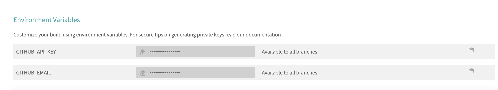

# **GitHub+Travis+Mkdocs自动化构建文档库(Istio)**

```
mkdocs new jxistiobook
cd jxistiobook
ls
docs		mkdocs.yml

echo "# jxawscsaabook" >> README.md
git init

git remote add origin https://github.com/Chao-Xi/jxistiobook.git
# pip3 install mkdocs-awesome-pages-plugin

mkdocs gh-deploy --clean --remote-name https://ghp_...@github.com/Chao-Xi/jxawscsaabook.git
```


* https://travis-ci.com
* https://app.travis-ci.com/github/Chao-Xi/jxistiobook

* `GITHUB_NAME`: github password
* `GITHUB_EMAIL`: xichao2015@outlook.com
* `GITHUB_API_KEY`: `ghp...jxhzd`

 

