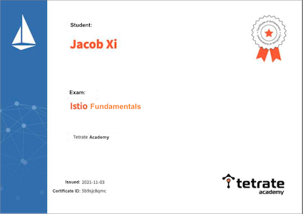

# Istio & Service Mesh 战术教程 

> Started at Augest 2021 By Jacob Xi 

## **About this tutorial**

This books is my 7th tech books published in almost 4 months. And this book is my most exhausted book so far. The weather is getting cooler and cooler🥶 and  double eleven is arouynd the corner. Totally nod idea what should I buy. Really appricate so team colleagues' and friends' support and instruction. 

## **Description**

`istio` 是由 Google、IBM、Lyft 等共同开源的 `Service Mesh`（服务网格）框架，于2017年初开始进入大众视野。`Kubernetes` 解决了云原生应用的部署问题，`istio` **解决的是应用的服务（流量）治理问题**。随着 2018年7月31日 istio 1.0 发布，istio 本身已经日趋稳定。

主题有以下内容：

* 微服务和 Service Mesh 核心组件 （Service Mesh 架构分析，服务注册中心，负载均衡器， 路由器及其限流熔断路由策略， 连接池，微服务网关（Kong））
* Service Mesh 实战
	* `VirtualService` 在 Istio 服务网格中**定义路由规则**，**控制路由如何路由到服务上**。
	* `DestinationRule` 是 `VirtualService` **路由生效后，配置应用与请求的策略集**。
	* `ServiceEntry` 是通常用于在 Istio **服务网格之外启用对服务的请求**。
	*  `Gateway` 为 `HTTP/TCP` **流量配置负载均衡器**，最常见的是在**网格的边缘的操作**，以**启用应用程序的入口流量。**
* Istio基础教学
* Istio高级教学 (1.10.3)-Bookinfo 流量管理
* Istio 高级教学与实践
* 实验与教学bookinfo(istio-1.3)-old
* JenkinsX + Istio渐进式交付
* Tetrate Istio基础培训与实验测试
* Istio日常操作与技巧

 

https://tetrate-academy.thinkific.com/certificates/5b9sjc8qmc

### **Previous on my Technolog book**

> [手摸手 Jenkins 战术教程 (大师版）](https://chao-xi.github.io/jxjenkinsbook/)
> 
> [手摸手 Elasticsearch7 技术与实战教程](https://chao-xi.github.io/jxes7book/)
> 
> [手摸手 Redis 技术与实战教程](https://chao-xi.github.io/jxredisbook/)
> 
> [手摸手 Chef & Ansible 技术与实战教程](https://chao-xi.github.io/jxchefbook/)
> 
> [手摸手 分布式与流式系统 (In progress)](https://chao-xi.github.io/jxdmsbook/)
> 
> [Azure 103&900 Tutorial (In progress)](https://chao-xi.github.io/jxazurebook/)
> 
> [手摸手 Linux Performance & 面试实战教程](https://chao-xi.github.io/jxperfbook/)
>
> [手摸手 Databases 全教程](https://chao-xi.github.io/jxdatabasebook/)
> 
>  [AWS Certified Data Analytics Tutorial](https://chao-xi.github.io/jxawscbdbook/)

## **Salut! C'est Moi**

> petite a petit l'oiseau fait son nid

Hello, this is me, Jacob. Currently, I'm working as DevOps and Cloud Engineer in SAP, and I'm the certified AWS Solution Architect and Certified Azure Administrator, Kubernetes Specialist, Jenkins CI/CD and ElasticStack enthusiast. 

I was working as Backend Engineer in New York City and achieved my CS master degree in SIT, America. Believe it or not, I'll keep writing, more and more books will come out at such dramatic and unprecedented 2021. 

If you have anything want to talk to me directly, you can reach out for via email xichao2015@outlook.com。

Salute, c'est moi, Jacob. Actuellement, je travaille en tant qu'ingénieur DevOps et Cloud dans SAP, et je suis architecte de solution AWS certifié et administrateur Azure certifié, spécialiste Kubernetes et passionné de CI/CD.

Je travaillais en tant qu'ingénieur backend à New York et j'ai obtenu mon master CS à SIT, en Amérique. Croyez-le ou non, je continuerai à écrire, de plus en plus de livres sortiront cette année.

## **Tutorial content**

* **第一章: 微服务和 Service Mesh 核心组件**
	* [第一节 Service Mesh 学习与架构分析](https://chao-xi.github.io/jxistiobook/chap1/1chap1_learn_SM/)
	* [第二节 服务注册中心](https://chao-xi.github.io/jxistiobook/chap1/2chap1_service_register/)
	* [第三节 负载均衡器](https://chao-xi.github.io/jxistiobook/chap1/3chap1_load_balancer/)
	* [第四节 路由器及其限流熔断路由策略](https://chao-xi.github.io/jxistiobook/chap1/4chap1_router/)
	* [第五节 连接池：阻塞式连接池和多路复用连接池的差异](https://chao-xi.github.io/jxistiobook/chap1/5chap1_conn_pool/)
	* [第六节 微服务网关（Kong）：网关在微服务架构中的作用](https://chao-xi.github.io/jxistiobook/chap1/6chap1_apigateway_kong/)
	* [第七节 微服务治理的配置中心](https://chao-xi.github.io/jxistiobook/chap1/7chap1_config_center/)
	* [第八节 Trace 更快速定位问题](https://chao-xi.github.io/jxistiobook/chap1/8chap1_trace/)
	* [第九节 利用 Prometheus 和 Grafana 收集监控数据](https://chao-xi.github.io/jxistiobook/chap1/9chap1_monitor/)
* **第二章: Service Mesh 实战**
	* [第一节 Service Mesh 开源产品中的技术选型](https://chao-xi.github.io/jxistiobook/chap2/1chap2_sm_prods/)
	* [第二节 最常用的数据面 Envoy介绍](https://chao-xi.github.io/jxistiobook/chap2/2chap2_sm_envoy/) 
	* [第三节 Istio 入门：基于最新 1.7 版本的环境搭建和介绍](https://chao-xi.github.io/jxistiobook/chap2/3chap3_isitio_17/)
	* [第四节 xDS：控制面和数据面的通信桥梁](https://chao-xi.github.io/jxistiobook/chap2/4chap3_xds/)
	* [第五节 Ingress 和 Egress：入口流量和出口流量控制](https://chao-xi.github.io/jxistiobook/chap2/5chap3_ingress_egress/)
	* [第六节 金丝雀发布：金丝雀部署和版本控制](https://chao-xi.github.io/jxistiobook/chap2/6chap3_canary/)
	* [第七节 如何利用组件做到服务的可观测性](https://chao-xi.github.io/jxistiobook/chap2/7chap3_monitor/)
	* [第八节 Proj项目落地: Go 实现 Service Mesh](https://chao-xi.github.io/jxistiobook/chap2/8chap3_SM_GO_PROJ/)
	* [第九节 Service Mesh 落地和展望](https://chao-xi.github.io/jxistiobook/chap2/9chap3_pratice/)
	* [第十节 Mesh的未来发展与可行性方向](https://chao-xi.github.io/jxistiobook/chap2/10chap3_mesh/)
* **第三章: Istio基础教学**
	* [第一节 服务网格(Service Mesh)是什么?](https://chao-xi.github.io/jxistiobook/chap3/0Service_Mesh/)
	* [第二节 Istio 架构与技术](https://chao-xi.github.io/jxistiobook/chap3/1isba_Frame_Tech/)
	* [第三节 Istio 服务发现和 Pilot的架构机制](https://chao-xi.github.io/jxistiobook/chap3/2isba_Service_Find/)
	* [第四节 Gateway 设计与实现](https://chao-xi.github.io/jxistiobook/chap3/3isba_Gateway/)
	* [第五节 Istio 灰度发布与技术实现](https://chao-xi.github.io/jxistiobook/chap3/4isba_Gray_release/)
	* [第六节 xDS协议解析](https://chao-xi.github.io/jxistiobook/chap3/5isba_Xds/)
	* [第七节 Mixer基础与实现](https://chao-xi.github.io/jxistiobook/chap3/6isba_Mixer/)
* **第四章: Istio(1.10.3)-Bookinfo 流量管理**
	* [第一节 2021 Service Mesh & Istio 介绍/安装(1.10.3)](https://chao-xi.github.io/jxistiobook/chap4/1Istio_Intro/)
	* [第二节 使用 Istio 实现非侵入流量治理](https://chao-xi.github.io/jxistiobook/chap4/2Istio_flow_control/)
	* [第三节 Istio 流量管理之故障注入](https://chao-xi.github.io/jxistiobook/chap4/3Istio_fault_inject/)
	* [第四节 Istio ServiceEntry 的填坑之路](https://chao-xi.github.io/jxistiobook/chap4/4Istio_ServiceEntry_issue/)
* **第五章: Istio(1.10.3)-Bookinfo 流量管理**
	* [第一节 服务网格的基本特征](https://chao-xi.github.io/jxistiobook/chap5/1Service_Mesh_Intro/)
	* [第二节 Istio 基本介绍](https://chao-xi.github.io/jxistiobook/chap5/2Istio_Intro/)
	* [第三节 Istio, Service Mesh 快速入门Istio 1.1.16](https://chao-xi.github.io/jxistiobook/chap5/3Istro_ServiceM_Prac/) 
	* [第四节 用Helm部署Istio](https://chao-xi.github.io/jxistiobook/chap5/4Istio_Helm/)
	* [第五节 Istio 常用功能 （自动/手动部署Istio应用）](https://chao-xi.github.io/jxistiobook/chap5/5Istio_funcs/)
	* [第六节 使用 Istio Dashboard Grafana / Prometheus](https://chao-xi.github.io/jxistiobook/chap5/6Istio_func2_grafana_prometheus/)
	* [第七节 使用 Istio Dashboard](https://chao-xi.github.io/jxistiobook/chap5/7Istio_fun3_Jager/)
	* [第八节 使用Kiali](https://chao-xi.github.io/jxistiobook/chap5/8Istio_func4_Kiali/)
	* [第九节 HTTPS流量管理(目标规则/默认路由/流量的拆分和迁移)](https://chao-xi.github.io/jxistiobook/chap5/9Istio_http1/)
	* [第十节 HTTPS流量管理(金丝雀部署/源服务进行路由/URI进行重定向)](https://chao-xi.github.io/jxistiobook/chap5/10Istio_http2/)
	* [第十一节 HTTPS流量管理（通信超时/故障重试/入口~出口流量管理)](https://chao-xi.github.io/jxistiobook/chap5/11Istio_http3/)
	* [第十二节 HTTPS流量管理（服务熔断/故障注入测试/注入中断/流量复制)](https://chao-xi.github.io/jxistiobook/chap5/12Istio_http4/)
	* [第十三节 Mixer 适配器的应用(简介/Denier访问控制/Listchecker访问控制)](https://chao-xi.github.io/jxistiobook/chap5/13Istio_Mixer1/)
	* [第十四节 Mixer 适配器的应用(MemQuota服务限流/Mixer对象的定义/RedisQuota服务限流)](https://chao-xi.github.io/jxistiobook/chap5/14Istio_Mixer2/)
	* [第十五节 Mixer 适配器的应用 - 为Prometheus定义监控指标](https://chao-xi.github.io/jxistiobook/chap5/15Istio_Mixer3_prometheus/)
	* [第十六节 使用stdio输出自定义日志](https://chao-xi.github.io/jxistiobook/chap5/16Istio_Mixer4_stdio/)
	* [第十七节 使用Fluentd输出日志](https://chao-xi.github.io/jxistiobook/chap5/17Istio_Mixer5_fluentd/)
	* [第十八节 Istio的安全加固（启用mTLS\加固概述)](https://chao-xi.github.io/jxistiobook/chap5/18Istio_Sec1/)
	* [第十九节 Istio的安全加固(RBAC设置\拍错))](https://chao-xi.github.io/jxistiobook/chap5/19Istio_Sec2_RBAC/)
	* [第二十节 Istio的试用建议](https://chao-xi.github.io/jxistiobook/chap5/20Istio_Usage/)
* **第六章: 实验与教学bookinfo(istio-1.3)-old**
	* [L1 Docker for Mac安装istio(k8s-1.10/istio-1.3)](https://chao-xi.github.io/jxistiobook/chap6/1Istio_install_docker/)
	* [L2 基于Bookinfo的流量管理配置(服务版本/基于权重/基于请求内容)](https://chao-xi.github.io/jxistiobook/chap6/2BookInfo_1/)
	* [L3 基于Bookinfo的流量管理配置(延迟访问/中断访问/不同环境/服务网格外)](https://chao-xi.github.io/jxistiobook/chap6/3BookInfo_2/)
* **第七章: JenkinsX + Istio渐进式交付**
	* [L1 Kubernetes 中的渐进式交付：蓝绿部署和金丝雀部署, shipper, Istio, Flagger](https://chao-xi.github.io/jxistiobook/chap7/k8s_adv54_release/)
	* [L2 使用 Jenkins X 渐进式交付](https://chao-xi.github.io/jxistiobook/chap7/k8s_adv56_jenkinsX/)
	* [L3 使用 Jenkins X 渐进式交付：自动化金丝雀部署](https://chao-xi.github.io/jxistiobook/chap7/k8s_adv57_Auto_Canary/)
* **第八章: Tetrate Istio基础培训与实验测试**
	* [第一节 服务网格和 Istio 概览](https://chao-xi.github.io/jxistiobook/chap8/1service_mesh/)
	* [第二节 安装 Istio](https://chao-xi.github.io/jxistiobook/chap8/2Istio_install/)
	* [第三节 可观察性：遥测和日志](https://chao-xi.github.io/jxistiobook/chap8/3Istio_mon/)
	* [第四节 流量管理](https://chao-xi.github.io/jxistiobook/chap8/4Istio_net_control/)
	* [第五节 流量管理实验与测试](https://chao-xi.github.io/jxistiobook/chap8/5Istio_net_control_exp/)
	* [第六节 Istio Secuirty](https://chao-xi.github.io/jxistiobook/chap8/6Istio_secruity/)
	* [第七节 Istio高级功能](https://chao-xi.github.io/jxistiobook/chap8/7Istio_adv_feas/)
	* [第八节 Istio 问题排查](https://chao-xi.github.io/jxistiobook/chap8/8Istio_trouble_shoot/)
	* [第九节 实际案例](https://chao-xi.github.io/jxistiobook/chap8/9Istio_real_instance/)
	* [第十节 术语表](https://chao-xi.github.io/jxistiobook/chap8/10Istio_terms/)
* **第九章: Istio日常操作与技巧**
	* [第一节 istio浅析 (Slide备案）](https://chao-xi.github.io/jxistiobook/chap9/1Istio_intro_ppt/)
	* [第二节 Istio 安全最佳实践](https://chao-xi.github.io/jxistiobook/chap9/2Istio_security/)
	* [第三节 记一次 Istio ServiceEntry 的填坑之路](https://chao-xi.github.io/jxistiobook/chap9/3Istio_service_entry/)
	* [第四节 使用 Istio 的十个技巧](https://chao-xi.github.io/jxistiobook/chap9/4Istio_istio_skill/)

## **To be continue**

I will put more effort do finish "Azure 103&900 Tutorial book" and "Distributed Message System Book" this month hopefully. And starting working on "AWS Solution Arcitect" and "Prometheus & APM monitoring", please waiting for it.🙂
	
 

	
	

 
